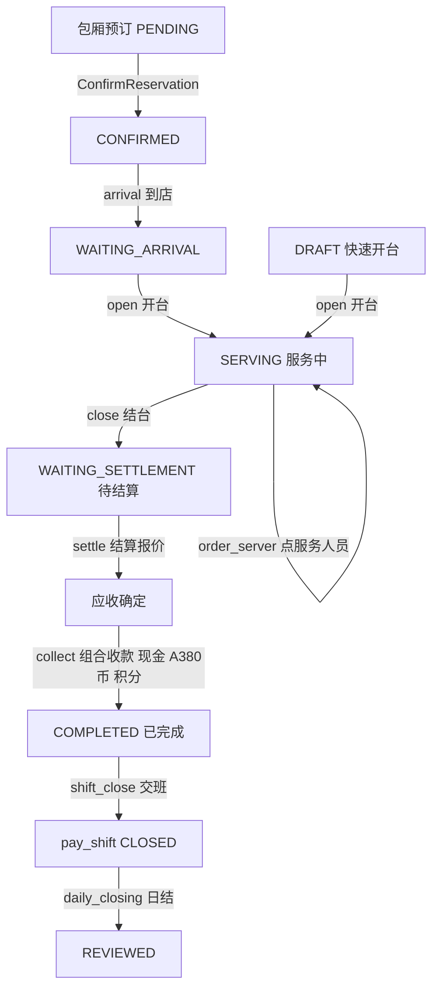
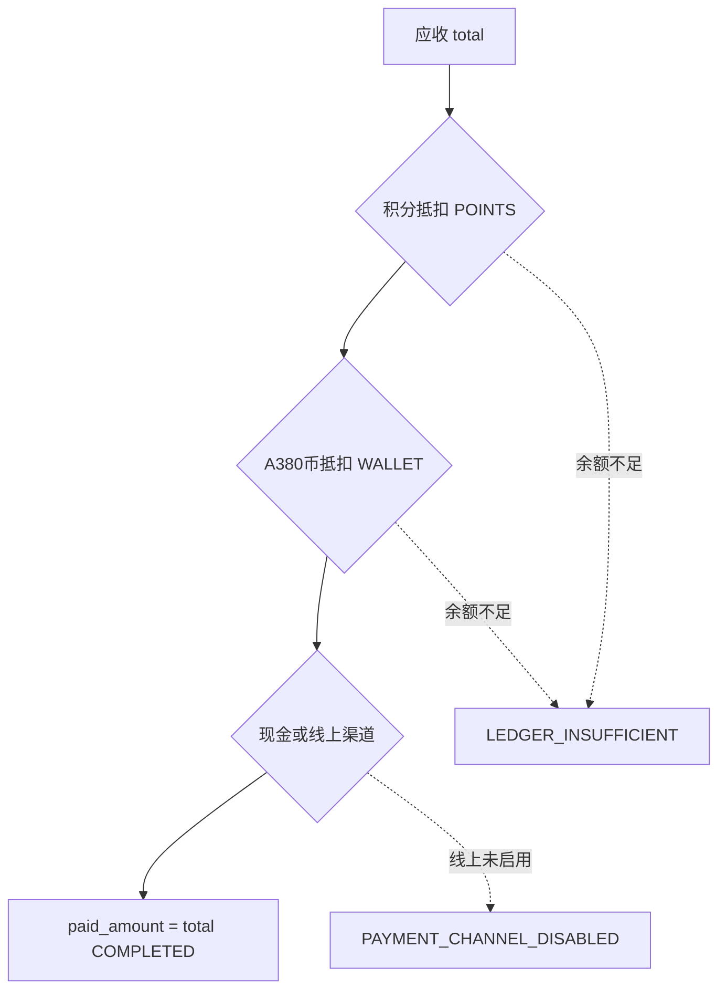
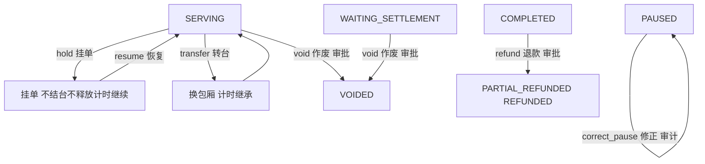

# KTV 业务细化方案（首发业态）

> **变更记录（v3）**
> - ① A380币品牌展示名改为独立租户配置表 `tnt_tenant_config`（key-value，`wallet_brand_name` 默认 `A380币`），不再给 `tnt_tenant` 加字段；② 服务人员点单计费口径：小时计费/半小时递增，分钟整数运算（每递增粒度单价），默认让利消费者（向下取整抹零），计费单位/递增粒度/舍入方向进计价方案可配；③ 业态定位：KTV 是首发业态之一，统一订单/资金/会员（含 A380币储值）/营销/租户 IAM 跨业态复用，KTV 专属履约/资源/计价方案独立。
>
> **变更记录（v2）**
> - ① 支付方式收敛为**现金 + A380币 + 积分**组合，支付宝/微信/Stripe 为「可开关且默认关闭」，不开启也能完整闭环；② 新增 **A380币充值管理**（对应 `cst_wallet` 储值账本）；③ 新增 **服务人员点单**（`KTV_SERVER` 资源类型 + 按单位时间计费）；④ 原 14 项待决点（D-1~D-14）全部转为正式结论（见 §16）；⑤ 新增**客户消费账单设计**（分级明细）；⑥ 新增 **Mermaid 业务流程图**（§13）；⑦ 后置方案拆为 `KTV_BUSINESS_02_APP/03_ADMIN/04_TEST` 三篇并细化到可派工。

## 0. 方案集声明

| 项目 | 内容 |
| --- | --- |
| 方案集 | `KTV_BUSINESS` |
| 顺序号 | `01` |
| 实施边界 | `SERVICE`（服务端业务细化） |
| 前置方案 | [SAAS_PLATFORM_01_SERVICE](SAAS_PLATFORM_01_SERVICE.md)（KTV 首发决策、§3 决策总览、§6 统一交易/资金/履约、§17 完成标准）、[SAAS_PLATFORM_02_SERVICE](SAAS_PLATFORM_02_SERVICE.md)（§5.2 权限码、§7 KTV 履约）、[SAAS_PLATFORM_04_DATA](SAAS_PLATFORM_04_DATA.md)（`res_resource`/`ord_order`/`ord_order_item`/`ord_ktv_session`/`cst_wallet_*`/`cst_point_*` 字段）、[SAAS_PLATFORM_05_API](SAAS_PLATFORM_05_API.md)（§6 订单与 KTV 履约、§7 支付、§8 会员营销）、[SAAS_PLATFORM_06_TECHNICAL](SAAS_PLATFORM_06_TECHNICAL.md)（§4.3 计时计费、§7.2 优惠叠加、§7.3 储值）、[SAAS_PLATFORM_09_SERVICE](SAAS_PLATFORM_09_SERVICE.md)（§3.3 KtvSession 聚合、§3.5 会员/营销聚合）、[SAAS_PLATFORM_03_APP](SAAS_PLATFORM_03_APP.md)/[SAAS_PLATFORM_08_APP](SAAS_PLATFORM_08_APP.md)（B 端页面与角色） |
| 后置方案 | [KTV_BUSINESS_02_APP](KTV_BUSINESS_02_APP.md)（B 端 KTV 页面/交互）、[KTV_BUSINESS_03_ADMIN](KTV_BUSINESS_03_ADMIN.md)（PC 后台配置：计价方案/服务人员/支付开关；储值为租户级「储值管理」页，见 §8）、[KTV_BUSINESS_04_TEST](KTV_BUSINESS_04_TEST.md)（自动化/联调/E2E） |
| 工程依据 | [业务微服务 DDD 工程规范](../standards/10_DDD_SERVICE_ENGINEERING_CONVENTIONS.md)、[持久层技术栈标准](../standards/21_PERSISTENCE_STACK.md)、[工程规范](../ENGINEERING_RULES.md) |

### 0.1 范围与一致性原则

本文把 KTV 从 SAAS_PLATFORM 的业务基线细化到可派工的实施深度。所有表名、字段、API 路径、错误码、权限码、状态枚举、事件名以既有 SAAS_PLATFORM 文档为准，不得自造；确需新增的字段/接口/错误码/权限码统一标注「**新增**」并给出理由。

1. **金额服务端计算**：客户端只提交选择项与 `expectedVersion`，不提交最终金额、税费、折扣结果或汇率（SAAS_PLATFORM_06 §4.2）。
2. **资源冲突后端判定**：同一资源时段重叠只能在资源服务事务内用 `SELECT ... FOR UPDATE` + 有效占用唯一约束判定（SAAS_PLATFORM_06 §3.1）。
3. **账本追加 + Outbox/Relay + 乐观锁 `version`**：资金/积分/储值只追加流水；业务事实与 Outbox 同库提交；写命令一律校验 `version`（SAAS_PLATFORM_06 §8、§4.1）。
4. **幂等**：所有写接口携带 `Idempotency-Key`（UUID，24 小时）；重复命令返回首次结果，不产生第二条事实（SAAS_PLATFORM_05 §2.1/§2.3）。
5. **各端金额一致**：金额只由服务端计算并返回「最小单位 + 币种字符串」，各端展示同一份账单快照，不自行计算（§9）。

### 0.2 术语表（v2 新增）

| 术语 | 定义 | 技术映射 |
| --- | --- | --- |
| **A380币** | 储值的**品牌展示名**（默认「A380币」，存租户配置表 `tnt_tenant_config` 的 `wallet_brand_name` 项，可自定义，非硬编码），客户可充值、消费、退还 | `cst_wallet_account` / `cst_wallet_ledger`（储值账本），同主体同币种 |
| **积分** | 会员积分，可抵扣应付 | `cst_point_account` / `cst_point_ledger` |
| **线上支付** | 支付宝/微信/Stripe | `tnt_merchant_account.provider ∈ {ALIPAY/WECHAT/STRIPE}`，可开关且默认关闭 |
| **服务人员点单** | 客户点服务员/公主/少爷等，按单位时间计费 | `res_resource.resource_type = KTV_SERVER`（**新增**）+ `ord_ktv_server_session`（**新增**） |
| **账单** | 客户消费分级明细 | `GET /orders/{id}/bill`（**新增**）只读返回 |

### 0.3 业态定位（KTV 是业态之一）

租户是**集团/组织**，其下可有多家、多业态门店；**KTV 是首发业态之一**，未来演进酒店、足浴、按摩、超市等，平台不等于 KTV：

| 层 | 归属 | KTV 说明 |
| --- | --- | --- |
| 跨业态复用（统一） | 统一订单/明细/资金（`ord_order`/`ord_order_item`/`pay_*`）、客户/会员/储值（`cst_*`，含 A380币储值）、营销（`mkt_*`）、租户/组织/门店/IAM（`tnt_*`/`iam_*`） | 不分业态，一套交易/资金/会员/营销内核 |
| KTV 专属（独立） | 履约 `ord_ktv_session`、资源 `KTV_ROOM`/`KTV_SERVER`、计价方案、服务人员点单 `ord_ktv_server_session` | 仅 KTV 使用，不污染统一订单模型 |
| 其他业态（后续） | `ord_hotel_stay`/`ord_spa_session` 等专属履约、房态/技师资源 | 复用统一订单/资金/会员，各建专属履约 |

本文所有「KTV」均指 KTV 业态；统一订单/资金/会员（A380币储值）/营销/租户 IAM 为跨业态能力，不随 KTV 命名。

---

## 1. 完整业务闭环与状态机

### 1.1 闭环总览

> **业态定位**：KTV 是首发**业态之一**（见 §0.3），本文只细化 KTV 业态的履约/资源/计价；统一订单/资金/会员（含 A380币储值）/营销/租户 IAM 跨业态复用。

KTV 首发闭环：**包厢预订（可选）→ 到店/快速开台 → 开台 → 计时（暂停/恢复）→ 加项 → 点服务人员（可选）→ 结台 → 结算（优惠/应收）→ 组合收款（现金/A380币/积分）→ 交班 → 日结**。线上支付（支付宝/微信/Stripe）默认关闭，现金 + A380币 + 积分已足够闭环。

| 事实 | 表 | 状态枚举 | 权威服务 |
| --- | --- | --- | --- |
| 预约生命周期 | `ord_reservation.status` | `PENDING/CONFIRMED/ARRIVED/CANCELLED/NO_SHOW/CONVERTED` | order |
| 统一订单商业状态 | `ord_order.status` | 见 §1.3 | order |
| KTV 履约状态 | `ord_ktv_session.status` | `RESERVED/OPEN/PAUSED/CLOSED/CANCELLED` | order |
| 服务人员点单状态 | `ord_ktv_server_session.status`（**新增**） | `ORDERED/SERVING/ENDED/CANCELLED` | order |
| 资源占用状态 | `res_occupation.status` | `HELD/RESERVED/IN_USE/RELEASED/CANCELLED` | resource |

### 1.2 预约（独立生命周期，可选）

预约不并入订单主生命周期，到店后与正式订单关联或转化（SAAS_PLATFORM_01 §6.1、SAAS_PLATFORM_04 §6.3）。

| 动作 | API 命令 | 前置状态 | 后置状态 | 领域事件 | 资源占用 |
| --- | --- | --- | --- | --- | --- |
| 创建预约 | `POST /api/v1/business/reservations` | 新建 | `PENDING` | `ReservationCreated` | 创建 `HELD`/`RESERVED` 占用 |
| 确认预约 | `POST /api/v1/business/reservations/{id}/confirm`（**新增**） | `PENDING` | `CONFIRMED` | `ReservationConfirmed`（**新增**） | 占用转 `RESERVED` |
| 修改预约 | `PUT /api/v1/business/reservations/{id}` | `PENDING`/`CONFIRMED` | 不变/更新时段 | — | 冲突时返回 `RESOURCE_OCCUPIED` |
| 到店登记 | `POST /api/v1/business/reservations/{id}/arrival` | `CONFIRMED` | `ARRIVED` → `CONVERTED`（生成/绑定订单） | `ReservationArrived`、`OrderCreated` | 占用转为订单关联 |
| 取消预约 | `POST /api/v1/business/reservations/{id}/cancel` | 到店前 | `CANCELLED` | `ReservationCancelled` | 释放占用 |
| 未到店 | 定时任务 | `CONFIRMED` 且过预约时刻 | `NO_SHOW` | — | 释放占用 |

> **结论（原 D-13）**：补 `ConfirmReservation` 命令 + `ReservationConfirmed` 事件，使 `PENDING → CONFIRMED` 成为显式状态转换（SAAS_PLATFORM_09 §3.3 仅列 `CreateReservation/ConfirmArrival/CancelReservation`，本方案补齐确认环节）。

> **实现口径差异（以代码为准，2026-09-18 复核，详见 `KTV_RESERVATION_ORDER_STATE_FLOW.md`）**：
> 本节的领域事件与占用设计是首版方案，落地实现与它有四处差异，按实现口径理解：
> 1. **预约不写资源占用**：预约对象是房型，创建/确认/到店都不产生 `res_occupation`；占用只由「开台」产生（`HELD`）。
> 2. **到店登记不生成订单**：`arrival` 只把 `CONFIRMED → ARRIVED` 并写 `arrived_at`；订单与会话在「到店开台」一次生成（订单 `DRAFT → SERVING`）。
> 3. **分配包厢不改状态**：`assign-room` 只写 `resource_id`（提前锁房 ≠ 客人到店）。
> 4. **未到店是显式动作**（`POST /business/reservations/{id}/no-show`，限「到店前 + 已过预约开始时间」），未做定时自动置位。
>
> 开台同时接受 `ARRIVED` 与 `CONFIRMED`（后者隐含登记到店时间），避免运营「先点客户到店、再点开台」的两步操作。

### 1.3 统一订单状态机

沿用 SAAS_PLATFORM_06 §4.1，KTV 走主链：

    DRAFT ──快速开台──> SERVING（经 open 开台命令）
    DRAFT ──有预约──> WAITING_ARRIVAL ──开台──> SERVING
    SERVING ──结台──> WAITING_SETTLEMENT ──收款──> COMPLETED
    SERVING ──作废(审批)──> VOIDED
    WAITING_SETTLEMENT ──作废(审批)──> VOIDED
    COMPLETED ──退款──> PARTIAL_REFUNDED / REFUNDED（不回退为未完成）

> **结论（原 D-14）**：`DRAFT` 可直接 `→ SERVING`（快速开台）或 `→ WAITING_ARRIVAL`（有预约），两者均为合法转换；`WAITING_ARRIVAL → SERVING` 由「开台」命令驱动。KTV 现金后付，不走 `WAITING_PAYMENT`。

### 1.4 KTV 会话、服务人员点单与包厢占用状态机

- `ord_ktv_session.status`：`RESERVED → OPEN → PAUSED(可选) → CLOSED`；异常 `CANCELLED`（SAAS_PLATFORM_06 §4.3、SAAS_PLATFORM_04 §6.3）。
- `ord_ktv_server_session.status`（**新增**）：`ORDERED → SERVING → ENDED`；异常 `CANCELLED`（§5）。
- `res_occupation.status`：`HELD → RESERVED → IN_USE → RELEASED`；异常 `CANCELLED`（SAAS_PLATFORM_04 §5.2）。KTV 结台后包厢/服务人员直接释放，无清洁环节（SAAS_PLATFORM_08 §4.8）。

### 1.5 命令明细表（每步的命令/前置/后置/事件）

| # | 动作 | API 命令 | 前置状态（订单/会话/占用） | 后置状态（订单/会话/占用） | 领域事件 |
| --- | --- | --- | --- | --- | --- |
| 1 | 快速开台 | `POST /api/v1/business/orders` | 新建 | `DRAFT` / `RESERVED` / `RESERVED` | `OrderCreated`、`ResourceOccupied` |
| 2 | 开台 | `POST /api/v1/business/ktv/sessions/{id}/open` | `DRAFT`或`WAITING_ARRIVAL` / `RESERVED` / `RESERVED` | `SERVING` / `OPEN` / `IN_USE` | `KtvSessionOpened`、`ResourceOccupied` |
| 3 | 暂停 | `POST /api/v1/business/ktv/sessions/{id}/pause` | `SERVING` / `OPEN` / `IN_USE` | `SERVING` / `PAUSED` / `IN_USE` | `KtvSessionPaused`（**新增**） |
| 4 | 恢复 | `POST /api/v1/business/ktv/sessions/{id}/resume` | `SERVING` / `PAUSED` / `IN_USE` | `SERVING` / `OPEN` / `IN_USE` | `KtvSessionResumed`（**新增**） |
| 5 | 加项 | `POST /api/v1/business/orders/{id}/items` | `SERVING` / `OPEN`或`PAUSED` / `IN_USE` | `SERVING`（追加明细）/ 不变 / 不变 | `OrderItemAdded` |
| 6 | 点服务人员 | `POST /api/v1/business/orders/{id}/servers`（**新增**） | `SERVING` / `OPEN` / `IN_USE` | `SERVING` / 不变 / 服务人员 `IN_USE` | `KtvServerOrdered`（**新增**） |
| 7 | 结束服务 | `POST /api/v1/business/ktv/servers/{id}/end`（**新增**） | `SERVING` / 服务人员 `SERVING` | `SERVING` / 服务人员 `ENDED` / 释放 | `KtvServerEnded`（**新增**） |
| 8 | 挂单 | `POST /api/v1/business/orders/{id}/hold` | `SERVING` | `SERVING`（挂单标记） | `OrderHeld`（**新增**） |
| 9 | 转台 | `POST /api/v1/business/orders/{id}/transfer` | `SERVING` / `OPEN` / `IN_USE` | `SERVING` / `OPEN`（换包厢）/ 旧`RELEASED`+新`IN_USE` | `ResourceReleased`、`ResourceOccupied` |
| 10 | 结台 | `POST /api/v1/business/ktv/sessions/{id}/close` | `SERVING` / `OPEN`或`PAUSED` / `IN_USE` | `WAITING_SETTLEMENT` / `CLOSED` / `RELEASED` | `KtvSessionClosed`、`ResourceReleased` |
| 11 | 结算报价 | `POST /api/v1/business/orders/{id}/settle`（含 promotions quote/apply） | `WAITING_SETTLEMENT` | `WAITING_SETTLEMENT`（固化应收快照） | `OrderSettlementQuoted` |
| 12 | 组合收款 | `POST /api/v1/business/orders/{id}/collect`（**新增**） | `WAITING_SETTLEMENT` / `CLOSED` | `COMPLETED` / `CLOSED` / `RELEASED` | `PaymentSucceeded`、`WalletConsumed`、`PointsRedeemed`、`OrderCompleted` |
| 13 | 作废 | `POST /api/v1/admin/orders/{id}/void` | `SERVING` 或 `WAITING_SETTLEMENT` | `VOIDED` / `CANCELLED` / `RELEASED` | `OrderVoided`、`ResourceReleased` |
| 14 | 退款 | `POST /api/v1/business/refund-requests` + `/admin/refund-requests/{id}/approve` | `COMPLETED` | `PARTIAL_REFUNDED`/`REFUNDED` | `RefundRequested`、`RefundApproved`、`RefundSucceeded`、`payment.refunded` |
| 15 | 交班 | `POST /api/v1/business/shifts/{id}/close` | `pay_shift.status=OPEN` | `CLOSED`/`REVIEW_REQUIRED` | `ShiftClosed` |
| 16 | 日结 | `POST /api/v1/admin/daily-closings/{id}/submit` + `review` | `DRAFT` | `SUBMITTED` → `REVIEWED`/`REOPENED` | `DailyClosingReviewed` |

> **结论（原 D-8）**：`ktv.session.opened/closed/paused/resumed` 及 `ktv.server.ordered/ended` 提升为 **MQ 事件**（SAAS_PLATFORM_05 §10 首发事件清单新增），供看板/报表/通知投影消费；资源投影仍可依赖 `resource.occupied/released`。

---

## 2. 计时计费规则细化

依据 SAAS_PLATFORM_06 §4.3 与 SAAS_PLATFORM_04 §6.3，由后端在**结台时**结算。

### 2.1 字段与口径

| 字段（`ord_ktv_session`） | 含义 | 来源/口径 |
| --- | --- | --- |
| `billing_unit` | 计费单位 | `HOUR`/`HALF_HOUR`/`PACKAGE`，门店计价方案，开台时固化 |
| `billing_start_at` | 起算时间 | 开台时计算并固化 |
| `free_wait_minutes` | 免费等待分钟 | 门店计价方案，默认 0 |
| `paused_seconds` | 暂停不计费时长（秒） | 暂停/恢复累计，只增不减 |
| `overtime_rate` | 超时费率 | DECIMAL，默认 1.0 |
| `billing_rule_snapshot_json` | 计费规则快照 | 结台时固化：单位、单价、舍入规则、标准时长、超时费率 |
| `reserved_start_at`/`reserved_end_at` | 预订时段 | 有预订时用于超时判定 |
| `opened_at`/`closed_at` | 开台/结台时间 | 服务端权威时间落库 |

### 2.2 计算公式

记（全部换算为秒，UTC 落库、门店时区展示）：

| 记号 | 定义 |
| --- | --- |
| `T_open` / `T_close` | `opened_at` / `closed_at` |
| `F` | `free_wait_minutes × 60` |
| `T_start` | `billing_start_at = T_open + F`（开台即计费时二者相等） |
| `P` | `paused_seconds` |
| `D` | 计费时长 `D = (T_close − T_start) − P`，且 `D ≥ 0` |
| `unit` | 计费单位秒数：`HOUR=3600`、`HALF_HOUR=1800`、`PACKAGE=套餐特判` |
| `S` | 标准时长：有预订 = `reserved_end_at − T_start`；无预订 = 门店 `default_session_minutes × 60`（默认 120 分钟） |
| `D_over` | 超时部分 `D_over = max(0, D − S)`；时段内部分 `D_in = D − D_over` |
| `price` | 包厢类型价目单价（每计费单位），固化快照 |
| `r` | `overtime_rate`（默认 1.0） |

**单位数取整**（SAAS_PLATFORM_06 §4.3-1，统一口径）：

    单位数 U(D) = ceil(D / unit)      // 计费时长向上取整到分钟，再按计费单位向上取整

**计时费**（超时加价只作用于超时部分，SAAS_PLATFORM_06 §4.3-4）：

    计时费 = price × U(D_in) + price × r × U(D_over)

**结台应收（计时费部分）**：

    计费时长快照 = { D, D_in, D_over, P, unit, price, r }
    计时费明细   = 计时费（item_type = ROOM_FEE，写入 ord_order_item）

> **开台即计费（2026-09-19）**：订单应收不允许停留在 0。**开台事务内**即按会话固化的计价方案快照写入
> `ROOM_FEE` 明细（房费 + 服务人员费）并重算订单金额，`KtvSessionApplicationService.open` 与结台共用
> 同一写入/更新逻辑（同一订单只保留一条 `ROOM_FEE`）。开台中由 `KtvRoomFeeRefreshJob`
> （`ktv.room-fee.refresh-ms` 默认 300000）跨租户扫描 `OPEN/PAUSED` 会话持续刷新，兼修存量漏账；
> 刷新只是过程量，**结台仍按 `closed_at` 精确重算**，因此刷新间隔不影响最终收费。
> 起步不足一个整计费单位时按 `CONSUMER_FAVOR` 让利记 0 块（33 秒 → 0 元），满一个单位即为一个整块。

> **结论（原 D-1）**：`PACKAGE` = 固定时长固定价套餐（如「欢唱 3 小时 ¥128」）；套餐时长内按套餐价一口价，超出套餐时长部分按门店标准计时单价（`price`）续费计费。套餐在「计价方案」配置（`KTV_BUSINESS_03_ADMIN` §4）。
> **结论（原 D-2）**：计费时长**向上取整到分钟**；金额按 `DECIMAL(20,6)` 计算后按**币种最小单位舍入**；时间区间统一**半开 `[start, end)`**（开始闭、结束开）。
> **结论（原 D-3）**：门店配置 `default_session_minutes`（**新增**，默认 120 分钟），无预订快速开台用它判定超时；有预订用 `reserved_end_at − T_start`。

### 2.3 暂停与计时不可倒退

- `pause` 仅在门店计价方案启用暂停时允许（SAAS_PLATFORM_06 §4.3-3）；未启用返回 `KTV_SESSION_PAUSE_DISABLED`（§12）。
- 暂停/恢复不改变 `billing_start_at`，只累计 `paused_seconds`；计时不可倒退，任何命令校验 `version` 乐观锁（SAAS_PLATFORM_06 §4.3）。
- 误暂停导致少计/多计：店长/财务可用 `correct-pause` 修正（§11.5、原 D-12）。

### 2.4 金额快照

结台时固化 `billing_unit`、`unit_price`、`D`、`P`、`D_over`、`overtime_rate` 与各明细金额；已完成订单的价格规则变化不影响历史快照（SAAS_PLATFORM_06 §4.2-6）。结台金额由 Order 结算服务按快照计算（SAAS_PLATFORM_04 §6.3）。

---

## 3. 包厢资源管理

### 3.1 资源与占用字段

`res_resource`（SAAS_PLATFORM_04 §5.1）：`resource_type ∈ {KTV_ROOM, KTV_SERVER(新增), HOTEL_ROOM(后续), SPA_ROOM(后续), THERAPIST(后续)}`、`resource_code`、`name`、`parent_id`、`capacity`、`status`、`attributes_json`；唯一 `(tenant_id, store_id, resource_type, resource_code)`。

`res_occupation`（SAAS_PLATFORM_04 §5.2）：`resource_id`、`source_type`、`source_id`、`start_at`、`end_at`、`status`（`HELD/RESERVED/IN_USE/RELEASED/CANCELLED`）、`hold_expires_at`、`version`。

### 3.2 资源行政状态机

> **结论（原 D-4）**：`res_resource.status` 枚举定为 **`ENABLED/DISABLED/MAINTENANCE`**（**新增**，SAAS_PLATFORM_04 §5.1 未列枚举值）。停用/维护需无有效占用（SAAS_PLATFORM_05 §5.2）。

| 看板状态 | 判定（投影自 `res_occupation.status` 与 `ord_ktv_session.status`） |
| --- | --- |
| 可用 | 无 `HELD/RESERVED/IN_USE` 有效占用，且 `res_resource.status = ENABLED` |
| 已预留 | 存在 `RESERVED` 占用（或 `ord_ktv_session.status = RESERVED`） |
| 使用中 | 存在 `IN_USE` 占用（或 `ord_ktv_session.status ∈ {OPEN, PAUSED}`） |
| 不可用 | `res_resource.status ∈ {DISABLED, MAINTENANCE}` |

### 3.3 时段占用冲突判定

- **重叠判定（半开区间）**：两时段 `[s1, e1)` 与 `[s2, e2)` 重叠当且仅当 `s1 < e2 AND s2 < e1`。
- **边界开闭**：采用「**开始时刻闭、结束时刻开**」`[start_at, end_at)`；A 结束时刻 = B 开始时刻视为不重叠，允许无缝接台。
- **后端事务判定**（SAAS_PLATFORM_06 §3.1）：按 `tenant_id + resource_id` 用 `SELECT ... FOR UPDATE` 锁定该资源有效占用记录 → 校验区间重叠、资源状态、门店与业务权限 → 创建 `HELD` 占用（带 `hold_expires_at`）→ 确认后转 `RESERVED`/`IN_USE` → 提交后发 `resource.occupied` Outbox 事件。
- 同一资源同一时段只能存在一个有效占用（SAAS_PLATFORM_01 §6.2）；Redis 锁只降冲突，数据库锁 + 唯一约束为最终防线。
- `HELD` 过期由定时任务按版本条件幂等释放（SAAS_PLATFORM_06 §3.2）。服务人员（`KTV_SERVER`）占用的冲突判定与包厢一致。

---

## 4. 加项（商品/服务）

KTV 加项为**无库存**加项：酒水/食品、服务费、服务人员费；不做酒水库存、不做最低消费（SAAS_PLATFORM_01 §3）。

### 4.1 明细类型映射

| 加项 | `ord_order_item.item_type` | 说明 |
| --- | --- | --- |
| 酒水/食品 | `PRODUCT` | 无库存，不扣减 |
| 服务费 | `FEE` | 附加服务费，**不参与优惠**（原 D-5） |
| 计时费 | `ROOM_FEE` | 开台即产生并随开台刷新（结台按 `closed_at` 重算），非人工加项，每单仅一条 |
| 服务人员费 | `SERVICE` | 服务人员点单计费产生（§5），是否参与优惠按 item 配置 |
| 套餐 | `PACKAGE` | 套餐类 |

### 4.2 规则

- **价格快照**：加项时固化 `name_snapshot`、`unit_price`、`quantity`、`price_snapshot_json`；后续改价不影响已加明细（SAAS_PLATFORM_06 §4.2）。
- **折扣规则**：加项明细参与优惠，按 §6 叠加优先级。
- **与计时费叠加**：加项独立计价，不与计时费合并（SAAS_PLATFORM_06 §4.3-5）。
- **命令**：`POST /api/v1/business/orders/{id}/items` 请求体 `{items[], expectedVersion}`，价格由服务端重算（SAAS_PLATFORM_05 §6.1）；前置 `SERVING`；版本不匹配返回 `ORDER_VERSION_CONFLICT`。

> **结论（原 D-5）**：服务费（`FEE`）**不参与折扣/满减/券**，仅计入总额（税基）。服务人员费（`SERVICE`）是否参与优惠按 catalog item 的 `participate_promotion` 配置（`KTV_BUSINESS_03_ADMIN` §5）。

---

## 5. 服务人员点单（v2 新增）

客户可点服务人员（服务员/公主/少爷等），按单位时间收费。服务人员作为 `res_resource` 的一种资源类型，点单占用其时段、按单位时间计费，费用并入结台结算。

### 5.1 资源类型与服务目录

- 资源类型 `KTV_SERVER`（**新增** `res_resource.resource_type`），唯一 `(tenant_id, store_id, KTV_SERVER, resource_code)`。
- 服务人员费的类型/单价/计费单位/是否参与优惠在 PC 后台按 catalog item 管理（`catalog.item` + `catalog.price`，`item_type=SERVICE`），资源 `res_resource` 关联 `catalog_item_id`（写入 `attributes_json.catalog_item_id`，**新增**）。

### 5.2 点单流程与状态机

| 动作 | API 命令 | 前置状态 | 后置状态 | 领域事件 | 资源占用 |
| --- | --- | --- | --- | --- | --- |
| 点单 | `POST /api/v1/business/orders/{id}/servers`（**新增**） | order `SERVING`；服务人员可用 | `ORDERED`（计时开始） | `KtvServerOrdered` | 服务人员 `IN_USE` |
| 服务中 | 内部计时 | `ORDERED` | `SERVING` | — | 保持 `IN_USE` |
| 结束服务 | `POST /api/v1/business/ktv/servers/{id}/end`（**新增**） | `ORDERED`/`SERVING` | `ENDED`（固化时长/金额） | `KtvServerEnded` | 服务人员 `RELEASED` |
| 取消点单 | `POST /api/v1/business/ktv/servers/{id}/cancel`（**新增**） | `ORDERED` 且未计费 | `CANCELLED` | `KtvServerCancelled`（**新增**） | 服务人员 `RELEASED` |

### 5.3 计费与结台

服务人员费按**分钟整数运算**（避免浮点小数），**并入结台结算**；计费口径如下（计费单位/递增粒度/舍入方向进计价方案可配）：

| 记号 | 定义 |
| --- | --- |
| `D_sec` | 服务时长秒 = `ended_at − started_at`（服务端权威时间） |
| `M` | 服务时长分钟（按舍入方向由 `D_sec` 换算，默认向下取整抹零） |
| `inc` | 递增粒度分钟（默认 30，半小时递增；可配 15/30/60） |
| `n` | 计费块数（不足一个粒度按一个粒度计，见舍入方向） |
| `price_per_inc` | 每递增粒度单价（「每半小时单价」，最小货币单位整数） |

**计费公式**：

    服务时长分钟  M = floor(D_sec / 60)     // 默认 CONSUMER_FAVOR：秒→分钟向下取整（抹零，让利消费者）
    计费块数      n = ceil(M / inc)         // 分钟→块：不足半小时按半小时计（向上取整到递增粒度）
    服务人员费      = price_per_inc × n      // 整数乘法，无浮点小数

**单价换算（避免小数）**：后台维护「每递增粒度单价」`price_per_inc`（最小货币单位整数，如「每半小时 ¥50」）；若仅维护小时价 `price_per_hour`，则 `price_per_inc = price_per_hour × inc / 60`，按门店舍入规则取整到最小货币单位；运算全程整数，无浮点小数。

**舍入方向 `rounding_direction`（租户可配，默认让利消费者）**：

| 方向 | 秒→分钟 | 分钟→块 | 说明 |
| --- | --- | --- | --- |
| `CONSUMER_FAVOR`（**默认，让利消费者**） | `floor` | `ceil` | 抹秒级零头，不足半小时按半小时计，宁可少收不超收 |
| `ROUND_UP`（从严） | `ceil` | `ceil` | 不满 1 分钟按 1 分钟 |
| `FLOOR_BLOCK`（最让利） | `floor` | `floor` | 不满半小时不计 |

- 计费在 `end` 时固化 `duration_seconds`、`duration_minutes`、`price_per_inc`、`total_amount`、`price_snapshot_json`；结台时作为 `SERVICE` 明细并入订单，参与优惠与否按 item 配置。
- 服务人员占用冲突返回 `RESOURCE_OCCUPIED`（同 §3.3）。
- **暂停语义**：服务人员服务中**不支持暂停计时**（与包厢计时暂停相互独立）；结束即固化时长，误操作走 `cancel` 或 `correct-pause`（包厢）补偿。
- 计费方式（计费单位/递增粒度/舍入方向）进「计价方案」配置（`KTV_BUSINESS_03_ADMIN` §4）。
- **首发占位默认值**（租户可配，上线前门店运营校准）：包厢 100 元/时、服务人员 50 元/时、`default_session_minutes=120`。

### 5.4 新增表 `ord_ktv_server_session`（**新增**）

| 字段 | 类型 | 约束/说明 |
| --- | --- | --- |
| `id` | BIGINT | PK |
| `tenant_id` | BIGINT | NOT NULL |
| `order_id` | BIGINT | NOT NULL |
| `ktv_session_id` | BIGINT | 关联包厢会话 |
| `server_resource_id` | BIGINT | 服务人员资源 |
| `catalog_item_id` | BIGINT | 服务目录 item（单价来源） |
| `ordered_at`/`started_at`/`ended_at` | DATETIME(3) | 点单/开始/结束时间 |
| `billing_unit` | VARCHAR(16) | 计费单位 `HOUR`/`HALF_HOUR`（默认 `HOUR`） |
| `increment_minutes` | INT | 递增粒度分钟（默认 30，半小时递增） |
| `rounding_direction` | VARCHAR(24) | `CONSUMER_FAVOR`/`ROUND_UP`/`FLOOR_BLOCK`（默认 `CONSUMER_FAVOR`） |
| `price_per_inc` | BIGINT | 每递增粒度单价（最小货币单位整数快照） |
| `duration_seconds` | INT | 服务时长（秒） |
| `duration_minutes` | INT | 计费分钟 `M` |
| `total_amount` | DECIMAL(20,6) | 服务人员费 |
| `price_snapshot_json` | JSON | 价格快照 |
| `status` | VARCHAR(16) | `ORDERED/SERVING/ENDED/CANCELLED` |
| `version` | INT | 乐观锁 |
| 审计字段 | — | `created_by/created_at/updated_by/updated_at` |

索引：`idx_ord_ktv_server_session_order(order_id)`、`idx_ord_ktv_server_session_server(server_resource_id, status)`。

---

## 6. 会员/优惠在 KTV 的应用

对齐 SAAS_PLATFORM_06 §7.2 固定优先级，并区分「优惠（减应收，无资金流水）」与「抵扣/支付（付应收，有账本流水）」两段：

    优惠（减应收）：门店/商品特价 → 会员价 → 活动折扣/满减（择一）→ 优惠券
    抵扣/支付（付应收）：积分抵扣 → A380币抵扣 → 现金/线上渠道（剩余兜底）

| 优惠/抵扣 | 载体 | KTV 应用规则 |
| --- | --- | --- |
| 会员价 | `cst_membership.level_id` | 会员专享价；作用于可配置明细 |
| 活动折扣/满减 | `mkt_campaign` | 择一，不叠加同类 |
| 优惠券 | `mkt_coupon` + `mkt_coupon_grant` | `discount_type/discount_value/min_amount/max_discount`；核销一次 |
| 积分抵扣 | `cst_point_ledger`（`REDEEM`） | 先冻结 → 收款成功后扣减，失败释放（SAAS_PLATFORM_06 §7.1） |
| A380币抵扣 | `cst_wallet_ledger`（`CONSUME`） | 同主体/同币种共享范围；首发不跨币种（SAAS_PLATFORM_06 §7.3） |
| 押金抵扣 | `pay_deposit_ledger` | **KTV 首发无押金** |

### 6.1 报价与锁定流程

    POST /orders/{id}/promotions/quote   → 返回可用优惠 + quoteId + 过期时间
    POST /orders/{id}/promotions/apply   → 结算前锁定（quoteId + expectedVersion）
    POST /orders/{id}/settle             → 重新校验并固化规则快照

> **结论（原 D-7）**：优惠时点在**结算阶段统一报价**：`原价合计 → 优惠 → 应收`。计时费（结台时确定）、加项、服务人员费在结算阶段统一纳入优惠基数计算，避免时点错位。

### 6.2 抵扣边界

- 积分/A380币抵扣不能使应付为负；差额用现金/渠道补齐。
- 退款/作废按规则产生反向流水：退款/作废不赚积分，退款按规则冲回积分与券（SAAS_PLATFORM_06 §7.1、SAAS_PLATFORM_09 §3.5）。
- 余额不足/主体不匹配/币种不匹配/门店不在共享范围 → 拒绝（SAAS_PLATFORM_06 §7.3），返回 `LEDGER_INSUFFICIENT`。

> **结论（原 D-6）**：满减门槛 `min_amount` **计入计时费（`ROOM_FEE`）**——结算阶段统一以「优惠前原价合计」为满减门槛与折扣基数。

---

## 7. 支付与收银结算

### 7.1 支付方式总览

| 支付方式 | 技术载体 | 默认状态 | 说明 |
| --- | --- | --- | --- |
| 现金 | `pay_intent` + `pay_transaction`（`provider=CASH`） | 始终可用 | 现金先行 |
| A380币（品牌名可配置） | `cst_wallet_ledger`（`CONSUME`） | 始终可用（有余额） | 储值品牌展示名，默认「A380币」，租户级可自定义 |
| 积分 | `cst_point_ledger`（`REDEEM`） | 始终可用（有积分） | 会员积分抵扣 |
| 支付宝 | `tnt_merchant_account.provider=ALIPAY` | **默认关闭** | 可开关 |
| 微信 | `provider=WECHAT` | **默认关闭** | 可开关 |
| Stripe | `provider=STRIPE` | **默认关闭** | 可开关，国际卡 |

> **结论**：支付宝/微信/Stripe 为「可开关且默认关闭」；`tnt_store_payment_config.enabled=0` 默认，未开启时 `available-methods` 不返回线上渠道，请求线上支付返回 `PAYMENT_CHANNEL_DISABLED`（**新增**，§12）。不开启线上支付，现金 + A380币 + 积分已能完整闭环。
>
> **储值品牌名可配置**：「A380币」是储值的默认品牌展示名，存租户配置表 `tnt_tenant_config` 的 `wallet_brand_name` 项（默认「A380币」），可自定义，非硬编码；账单/支付/充值各端统一展示该配置值，客户端与服务端均不硬编码文案。

### 7.2 组合支付流程

组合支付按固定顺序逐笔执行，**每笔金额 ≤ 剩余应收**，服务端返回剩余应收与各渠道已收：

    1. 积分抵扣（cst_point_ledger REDEEM，先冻结后扣减）
    2. A380币抵扣（cst_wallet_ledger CONSUME，先冻结后扣减）
    3. 现金/线上渠道支付剩余（pay_intent，现金默认，线上需启用）

| 步骤 | API | 说明 |
| --- | --- | --- |
| 查可用方式 | `GET /payments/available-methods` | 返回现金/A380币/积分可用性与线上渠道开关状态，金额仅用于能力校验 |
| 组合收款 | `POST /api/v1/business/orders/{id}/collect`（**新增**） | 入参 `{payments:[{method,amount}], expectedVersion}`；服务端按积分→A380币→现金顺序逐笔校验 `amount ≤ 剩余应收`，执行账本/支付，返回 `{remainingAmount, collectedByMethod[]}` |

组合收款幂等：`Idempotency-Key` + `expectedVersion`；重复调用返回首次结果，不重复扣积分/储值/现金。

### 7.3 应收明细计算顺序

结算服务按 SAAS_PLATFORM_06 §4.2 依次执行：

1. 读取价目、KTV 计时规则、门店税率和活动规则快照；
2. 计算明细原价：计时费（§2）+ 各加项明细 + 服务人员费（§5）；
3. 按 §6 优惠优先级应用优惠并舍入；
4. 计算税费 `tax_amount`；
5. 汇总 `subtotal_amount`/`discount_amount`/`tax_amount`/`total_amount`，生成应付与可退款金额；
6. 写入订单金额快照，返回明细、币种、税费、优惠承担方和规则版本。

订单金额字段（SAAS_PLATFORM_04 §6.1）：`subtotal_amount`、`discount_amount`、`tax_amount`、`total_amount`、`paid_amount`、`refundable_amount`。

### 7.4 现金收款

现金支付意图 `CREATED → PROCESSING → SUCCEEDED/FAILED/CLOSED`；收银确认现金 → `pay_transaction`（`provider=CASH`）写入 + 订单支付汇总 + Outbox 同一事务提交（SAAS_PLATFORM_06 §5.2）。关联 `pay_shift` 与 `terminal`。

### 7.5 退款

- 收银员只能申请，店长/财务审批，申请人不能自批（SAAS_PLATFORM_01 §7、SAAS_PLATFORM_09 §3.4）。
- 退款优先原支付渠道；现金退款线下登记需财务权限（`payment.refund.offline`，**新增**，原 D-9）。A380币退款走 `cst_wallet_ledger REFUND`（退还储值），积分退款走 `cst_point_ledger` 反向流水。
- 退款金额不可超原交易可退款金额（SAAS_PLATFORM_09 §3.4）。

### 7.6 交班现金对账

`pay_shift`（SAAS_PLATFORM_04 §7.3）：`opening_cash`、`expected_cash`、`actual_cash`、`difference_amount`、`status`。

    expected_cash = opening_cash + Σ(班次内现金收款) − Σ(班次内现金退款)
    difference_amount = actual_cash − expected_cash

差额 ≠ 0 必须填写原因，交班后进入 `REVIEW_REQUIRED`（SAAS_PLATFORM_08 §4.7）。A380币/积分收款不入现金对账，单独在 `pay_daily_closing.summary_json` 汇总。

### 7.7 日结

`pay_daily_closing`：`business_date`、`status`（`DRAFT/SUBMITTED/REVIEWED/REOPENED`）、`summary_json`；唯一 `(tenant_id, store_id, business_date)`。`summary_json` 汇总当日订单、现金/A380币/积分收款、退款、班次与差额。

---

## 8. A380币充值管理（v2 新增）

租户 B 端后台提供 A380币充值管理：充值（现金/线下转账收储值）、余额查询、充值/账本流水、储值退还。

> **唯一入口（2026-09-19 合并）**：储值账户按 `(tenant_id, customer_id, legal_entity_id, currency_code)` 唯一，
> 是**租户级**资产、**跨门店共用**，因此后台只有租户级「储值管理」页一个入口。
> KTV 配置页原有的「A380币充值」页签与 BFF 端点 `/admin/ktv/wallet-recharge` 已删除（见 KTV_BUSINESS_03_ADMIN §6）。

> **账户懒初始化（2026-09-19）**：储值账户只在**首次充值**时创建。读路径（余额/流水/列表/C 端「我的资产」）
> 对没有账户的会员返回零额只读视图与空流水（`accountOpened=false`，界面显示「未开立」），不落库也不报
> `WALLET_ACCOUNT_NOT_FOUND`；消费/退还按 `LEDGER_INSUFFICIENT`（余额 0）拒绝，RELEASE 为空操作。
> 迁移 `V3__cst_wallet_account_lazy_init_cleanup.sql` 清理「零余额且无任何流水」的历史空账户。

> **品牌展示名可配置**：充值/余额/流水/退还页面标题与文案统一使用租户配置表 `tnt_tenant_config` 的 `wallet_brand_name` 项（默认「A380币」）；租户可在后台自定义（如「皇冠币」「储值」等），非硬编码。账单（§9）、支付（§7）展示同源。

### 8.1 账户与账本

- `cst_wallet_account`（SAAS_PLATFORM_04 §8.3）：`available_amount`、`frozen_amount`、`status`、`version`；唯一 `(tenant_id, customer_id, legal_entity_id, currency_code)`。
- `cst_wallet_ledger`（SAAS_PLATFORM_04 §8.3）：`entry_type ∈ {RECHARGE, CONSUME, REFUND, HOLD, RELEASE, ADJUST}`、`amount`、`balance_after`、`idempotency_key`；唯一 `(tenant_id, idempotency_key)`。

### 8.2 充值流程

| 动作 | API（**新增**） | 说明 |
| --- | --- | --- |
| 充值 | `POST /api/v1/admin/wallets/recharge` | `{customerId, amount, currency, paymentMethod(CASH/OFFLINE_TRANSFER), referenceNo?}`；走 `cst_wallet_ledger RECHARGE` 追加，**禁止直接改余额** |
| 余额查询 | `GET /api/v1/business/wallets/{customerId}` | 返回 `available_amount`/`frozen_amount` |
| 账本流水 | `GET /api/v1/business/wallets/{customerId}/ledger` | 分页返回 `RECHARGE/CONSUME/REFUND/...` 流水 |
| 储值退还 | `POST /api/v1/admin/wallets/refund` | 走 `cst_wallet_ledger REFUND`，需权限 + 审计 |

### 8.3 审计与幂等

- 充值/退还涉资金：写 `iam_audit_log`（操作者/金额/客户/原因/前后摘要），携带 `Idempotency-Key`，账本唯一 `(tenant_id, idempotency_key)` 防重。
- 充值到账即追加 `RECHARGE` 流水并更新 `available_amount`（同一事务）；禁止 `UPDATE` 余额绕过流水（SAAS_PLATFORM_06 §7.3）。
- 线下转账充值需关联凭证（`reference_no`），由财务/店长复核。

---

## 9. 客户消费账单设计（v2 新增）

账单清晰可读、分级明细，在客户 App 由服务端结构化呈现；金额各端严格一致。

### 9.1 账单分级明细

| 层级 | 内容 | 字段 |
| --- | --- | --- |
| 1 包厢计时费 | 时段/单价/时长/金额 | `period{start,end}`、`unitPrice`、`duration`、`amount` |
| 2 加项 | 商品/单价/数量/金额 | `name`、`unitPrice`、`quantity`、`amount` |
| 3 服务人员费 | 人员/时长/单价/金额 | `serverName`、`duration`、`unitPrice`、`amount` |
| 4 优惠逐项 | 券/折扣/积分抵扣 | `type{COUPON/DISCOUNT/FULL_REDUCTION/MEMBER_PRICE}`、`amount` |
| 5 应收合计 | 优惠后应收 | `totalAmount` |
| 6 已收分项 | 现金/A380币/积分 | `cash`、`wallet`、`points` |
| 7 找零 | 现金找零 | `changeAmount` |

### 9.2 账单接口

| 方法与路径 | 说明 |
| --- | --- |
| `GET /api/v1/business/orders/{id}/bill`（**新增**） | 只读返回分级明细账单；金额只由服务端计算，返回最小单位 + 币种字符串 |

### 9.3 金额一致性与快照

- 金额只由服务端计算并返回「最小单位 + 币种字符串」，各端展示**同一份账单快照**，不自行计算税费/折扣/抵扣/找零。
- 账单快照在 `COMPLETED` 时固化（与 `order.completed` 事件同事务），历史改价/改规则不影响已结账单。
- 客户 App（C 端）调用该接口展示；B 端收银页展示同一份账单数据源（SAAS_PLATFORM_08 §4.6 订单工作台）。

---

## 10. 权限矩阵

权限码沿用 SAAS_PLATFORM_02 §5.2 的 `module.resource.action`，服务端同时校验权限码、作用域与业务状态。

### 10.1 角色与动作矩阵（KTV 场景）

| 动作 | 权限码 | 店长 | 收银员 | 服务员 | 前台/预约 | 财务 |
| --- | --- | :-: | :-: | :-: | :-: | :-: |
| 包厢/预订查看 | `reservation.view` | ✓ | ✓ | ✓(本店) | ✓ | — |
| 预订创建/改/取消 | `reservation.create`/`reservation.cancel` | ✓ | ✓ | — | ✓ | — |
| 确认预约 | `reservation.confirm`（**新增**） | ✓ | — | — | ✓ | — |
| 到店登记 | `reservation.arrival`（**新增**） | ✓ | ✓ | — | ✓ | — |
| 快速开台/开台 | `order.create` + `ktv.session.open` | ✓ | ✓ | — | — | — |
| 暂停/恢复 | `ktv.session.pause`/`ktv.session.resume`（**新增**） | ✓ | ✓ | — | — | — |
| 暂停修正 | `ktv.session.correct_pause`（**新增**） | ✓ | — | — | — | ✓ |
| 加项 | `order.add_item`（**新增**） | ✓ | ✓ | ✓(自己关联订单) | — | — |
| 点服务人员 | `ktv.server.order`（**新增**） | ✓ | ✓ | — | — | — |
| 挂单 | `order.hold`（**新增**） | ✓ | ✓ | — | — | — |
| 转台 | `order.transfer`（**新增**） | ✓ | ✓ | — | — | — |
| 结台 | `ktv.session.close` | ✓ | ✓ | ✓(协助) | — | — |
| 结算/优惠 | `order.settle` | ✓ | ✓ | — | — | — |
| 组合收款 | `payment.collect` | ✓ | ✓ | — | — | — |
| 退款申请 | `payment.refund.request` | ✓ | ✓ | — | — | — |
| 退款审批 | `payment.refund.approve` | ✓(本店) | — | — | — | ✓ |
| 线下退款 | `payment.refund.offline`（**新增**） | — | — | — | — | ✓ |
| 作废申请/审批 | `order.void` | ✓(审批) | 申请 | — | — | ✓(复核) |
| 反结 | `order.reverse_settlement` | — | — | — | — | ✓ |
| A380币充值 | `wallet.recharge`（**新增**） | ✓ | ✓ | — | — | ✓ |
| A380币退还 | `wallet.refund`（**新增**） | — | — | — | — | ✓ |
| A380币余额/流水 | `wallet.view`（**新增**） | ✓ | ✓ | — | — | ✓ |
| 开班 | `shift.open`（**新增**） | ✓ | ✓ | — | — | — |
| 交班 | `shift.close` | ✓ | ✓ | — | — | — |
| 日结提交 | `daily_close.submit` | ✓ | — | — | — | ✓ |
| 日结复核 | `daily_close.review` | — | — | — | — | ✓ |
| 审计查看 | `audit.view` | — | — | — | — | ✓ |

> 服务员仅可操作「自己关联的服务卡片/订单」加项与结台协助（SAAS_PLATFORM_03 §6）。跨店转台需店长/财务权限 + 数据范围校验（原 D-11）。

### 10.2 新增权限码汇总

| 权限码（**新增**） | 理由 |
| --- | --- |
| `reservation.confirm` / `reservation.arrival` | 补确认预约与到店登记权限（原 D-13 / SAAS_PLATFORM_05 §5.3） |
| `ktv.session.pause` / `ktv.session.resume` / `ktv.session.correct_pause` | 暂停/恢复/修正（原 D-12） |
| `ktv.server.order` | 服务人员点单（§5） |
| `order.add_item` / `order.hold` / `order.transfer` | 加项/挂单/转台 |
| `payment.refund.offline` | 线下退款登记（原 D-9，财务专属） |
| `wallet.recharge` / `wallet.refund` / `wallet.view` | A380币充值/退还/查询（§8） |
| `shift.open` | 开班 |

---

## 11. 异常处理

### 11.1 挂单（hold）

> **结论（原 D-10）**：挂单**不结台、不释放包厢、计时继续**；仅挂起后续操作提示，不改商业状态（`SERVING` 内操作标记），新增字段 `hold_reason`/`hold_at`（**新增**）。

- 命令 `POST /api/v1/business/orders/{id}/hold`，请求体 `{reason}`（SAAS_PLATFORM_05 §6.1）。

### 11.2 转台（transfer）

> **结论（原 D-11）**：转台**计时继承（累计）**，不重置；跨店转台需店长/财务权限 + 数据范围校验。

- 命令 `POST /api/v1/business/orders/{id}/transfer`，请求体 `{targetStoreId?, targetResourceId?, reason}`。
- 换包厢：先锁新资源 → 释放旧占用（`ResourceReleased`）→ 占用新包厢（`ResourceOccupied`）；新包厢冲突返回 `RESOURCE_OCCUPIED`，旧占用不释放（事务回滚）。

### 11.3 作废（void）

- 高风险动作，审批后执行（SAAS_PLATFORM_05 §6.1）。订单 → `VOIDED`；释放包厢/服务人员占用；已收款冲正（积分 `REVERSE`、储值 `ADJUST`，现金退款）。
- 作废窗口、双人复核为业务规则与审批流，不硬编码到角色（SAAS_PLATFORM_01 §7）。

### 11.4 退款（refund）

- 退款不将订单回退为未完成（SAAS_PLATFORM_01 §6.1）；申请人与审批人分离（SAAS_PLATFORM_09 §3.4）。
- 幂等：`pay_refund` 唯一 `(tenant_id, request_id)`；A380币退还走 `cst_wallet_ledger REFUND`，积分走反向流水。

### 11.5 计时异常与补偿

| 异常 | 处理 | 依据 |
| --- | --- | --- |
| 断电/服务重启 | `opened_at`/`closed_at`/`paused_seconds` 服务端权威时间落库，恢复靠幂等命令与查询 | SAAS_PLATFORM_06 §4.3 |
| 误暂停 | 有权限者 `resume` 恢复，`paused_seconds` 只增不减；计时不可倒退 | SAAS_PLATFORM_09 §3.3 |
| 超时 | 超时部分自动按 `overtime_rate` 加价 | SAAS_PLATFORM_06 §4.3-4 |
| 误暂停导致少计/多计 | **结论（原 D-12）**：补 `POST /api/v1/business/ktv/sessions/{id}/correct-pause`（**新增**）命令，店长/财务，写 `iam_audit_log`，修正 `paused_seconds` | — |
| 重复结台/释放 | 重复释放返回成功但不产生第二条事实；释放任务幂等 | SAAS_PLATFORM_06 §3.2 |
| 跨聚合失败 | 资源占用失败明确补偿（释放命令），不跨库事务 | SAAS_PLATFORM_09 §3.3 |

### 11.6 幂等与审计

- 所有写命令 `Idempotency-Key`；重复返回首次结果 + 相同 `requestId`（SAAS_PLATFORM_05 §2.3）。
- 高风险动作（改价、整单优惠、作废、反结、线下退款、暂停修正、A380币充值/退还、跨店操作）写 `iam_audit_log`（SAAS_PLATFORM_01 §7）。
- 资金/审计写入失败时宁可拒绝业务，不静默成功（SAAS_PLATFORM_06 §12）。

---

## 12. 错误码与幂等

### 12.1 错误码基线（复用）

| 错误码 | HTTP | KTV 场景 |
| --- | --- | --- |
| `RESOURCE_OCCUPIED` | 409 | 包厢/服务人员时段冲突 |
| `ORDER_VERSION_CONFLICT` | 409 | 乐观锁失败 |
| `ORDER_STATUS_INVALID` | 422 | 命令与状态不符 |
| `PAYMENT_IDEMPOTENCY_REPLAY` | 409/200 | 重复支付返回首次结果 |
| `PAYMENT_PROCESSING` | 409 | 支付处理中 |
| `REFUND_APPROVAL_REQUIRED` | 422 | 需审批 |
| `LEDGER_INSUFFICIENT` | 422 | 积分/A380币余额不足 |
| `PROMOTION_EXPIRED` | 422 | 优惠过期 |
| `IDEMPOTENCY_CONFLICT` | 409 | 同键不同请求体 |
| `RESERVATION_SCOPE_INVALID` | 422/409 | 跨店资源/预约范围非法 |
| `CURRENCY_CORRIDOR_DISABLED` | 422 | 跨币种禁止 |
| `TENANT_SCOPE_DENIED` | 403 | 越权/越租户 |
| `AUTH_CONTEXT_EXPIRED` | 401 | 上下文过期 |

### 12.2 新增错误码

| 错误码（**新增**） | HTTP | 理由 |
| --- | --- | --- |
| `KTV_SESSION_PAUSE_DISABLED` | 422 | 暂停未配置启用 |
| `KTV_SESSION_CLOCK_CONFLICT` | 409 | 计时倒退/修正冲突 |
| `ORDER_ALREADY_SETTLED` | 409 | 重复结台/已结算 |
| `RESERVATION_ALREADY_CONVERTED` | 409 | 预约已转订单 |
| `SHIFT_ALREADY_OPEN` | 409 | 同一终端已开班 |
| `PAYMENT_AMOUNT_MISMATCH` | 422 | 收款金额与服务端应收不符 |
| `PAYMENT_CHANNEL_DISABLED` | 422 | 线上渠道未启用（默认关闭） |

### 12.3 幂等约定

| 写操作 | 幂等键 | 唯一约束/依据 |
| --- | --- | --- |
| 通用写接口 | `Idempotency-Key`（UUID，24h） | SAAS_PLATFORM_05 §2.1 |
| 支付 | `tenantId + orderId + idempotencyKey` | `pay_intent` 唯一 `(tenant_id, idempotency_key)` |
| 组合收款 | `Idempotency-Key` + `expectedVersion` | 重复返回首次结果，不重复扣减 |
| 退款 | `request_id` | `pay_refund` 唯一 `(tenant_id, request_id)` |
| 积分/储值流水 | `idempotency_key` | `cst_point_ledger`/`cst_wallet_ledger` 唯一 `(tenant_id, idempotency_key)` |
| Outbox | `event_id` | `{domain}_outbox` 唯一 `event_id` |
| KTV 会话/点单命令 | `Idempotency-Key` + `expectedVersion` | 重复 `open/pause/resume/close/order_server/end` 返回首次结果 |

---

## 13. 业务流程图（Mermaid）

### 13.1 主流程

### 13.2 收款流程

### 13.3 异常分支

---

## 14. 业界最佳实践参考

参考业界成熟 KTV（纯K、海伦司、万达大歌星、嘉年华/银柜 KTV 等）的计价与账单呈现方式，融入本设计（仅作业务参考，不引入运行时依赖）：

| 业界实践 | 说明 | 本方案采纳 |
| --- | --- | --- |
| 按小时/半小时计时 | 包厢按计费单位计价，不同时段不同价 | §2 计费单位 + 时段价目 |
| 包段/套餐一口价 | 「欢唱 3 小时 ¥128」固定时长固定价 | §2 `PACKAGE` 套餐 |
| 时段价/时段选择 | 白天/晚间/黄金时段多档价 | §2 价目快照 + 计价方案 |
| 服务费单列 | 账单单列 10% 服务费等 | §4 `FEE` 明细 |
| 点单服务人员按人按时 | 公主/少爷/陪唱按人按小时计费（台费） | §5 服务人员点单 |
| 低消（最低消费） | 部分门店按包厢设低消，酒水抵扣 | **不采纳**（SAAS_PLATFORM_01 §3 明确不做最低消费） |
| 账单分级明细 | 房费/酒水/小食/服务费/人头费分项，合计 + 找零 | §9 账单分级明细 |
| 会员/储值/积分 | 充值赠送、会员价、积分抵扣 | §6/§8 A380币 + 积分 |

参考来源：[纯K 时段套餐](https://utravel.com.hk/news/detail/20035757/)、[KTV 计价方式](https://www.pttweb.cc/bbs/Anti-ramp/M.1163641544.A.5C9)、[万达大歌星价格](https://page.sm.cn/blm/midpage-317/index?id=12_2064d37b4610eaa74ea12ed20c0c8fd4)、[嘉年华/银柜 KTV 消费说明](https://www.silverbox.com.tw/consumption/5/)。

---

## 15. E2E 验收用例

### 15.1 主闭环 E2E-KTV-01（开台→计时→加项→点服务人员→结台→组合收款→日结）

前置：租户已开通，门店配置时区/币种/税率/营业日切点/计价方案（包厢单价、加项价目、服务人员价目），包厢 `A01`、服务人员 `S01` 可用，客户有 A380币余额与积分，收银员 `C1` 开班，店长 `M1`、财务 `F1` 在岗。

| 步骤 | 动作 | 预期断言 |
| --- | --- | --- |
| 1 | 收银员开班 `POST /shifts/open` | `pay_shift.status=OPEN`；重复开班返回 `SHIFT_ALREADY_OPEN` |
| 2 | 快速开台 `POST /orders`（选包厢 A01） | `ord_order.status=DRAFT`、session `RESERVED`、占用 `RESERVED` |
| 3 | 开台 `POST /ktv/sessions/{id}/open` | session `OPEN`、`billing_start_at` 固化、order `SERVING`、占用 `IN_USE`；**同事务写 `ROOM_FEE`（房费+服务费）并重算订单应收，即刻 > 0**（不足一个计费单位时为 0，满单位后为非 0） |
| 4 | 暂停/恢复 `pause`/`resume` | session `PAUSED`→`OPEN`，`paused_seconds` 累计只增不减 |
| 5 | 加项 `POST /orders/{id}/items`（酒水 2 瓶） | `ord_order_item` 追加 `PRODUCT`，`price_snapshot_json` 固化 |
| 6 | 点服务人员 `POST /orders/{id}/servers`（S01） | `ord_ktv_server_session.status=ORDERED`、服务人员占用 `IN_USE` |
| 7 | 结束服务 `POST /ktv/servers/{id}/end` | `ENDED`、`duration_seconds`/`total_amount` 固化、服务人员释放 |
| 8 | 结台 `POST /ktv/sessions/{id}/close` | session `CLOSED`、按 `closed_at` 重算计时费 `ROOM_FEE` + 服务人员费 `SERVICE` 明细、包厢释放、order `WAITING_PAYMENT`（结台即结算；存在 `PENDING_APPROVAL` 客户加项时保持 `WAITING_SETTLEMENT`） |
| 9 | 结算 `POST /orders/{id}/settle` | 返回应收：`total = 计时费 + 加项 + 服务人员费 − 优惠 + 税`；不可传最终金额 |
| 10 | 组合收款 `POST /orders/{id}/collect`（积分 100 + A380币 50 + 现金余） | 逐笔 ≤ 剩余应收，返回 `remainingAmount` 与 `collectedByMethod`；账本流水 `REDEEM`/`CONSUME`/`pay_transaction` 各自一笔 |
| 11 | 重复收款（同 Idempotency-Key） | 返回首次结果，不产生第二笔资金事实 |
| 12 | 查询账单 `GET /orders/{id}/bill` | 分级明细：计时费/加项/服务人员费/优惠/应收/已收分项/找零，金额一致 |
| 13 | 交班 `POST /shifts/{id}/close` | `expected_cash` 仅含现金，`difference_amount=0`，`status=CLOSED` |
| 14 | 日结 `submit` + 复核 | `status=SUBMITTED → REVIEWED`，`summary_json` 含现金/A380币/积分分项汇总 |

### 15.2 补充用例

| 编号 | 场景 | 关键断言 |
| --- | --- | --- |
| E2E-KTV-02 | 同包厢并发开台 | 最多一个成功，其余 `RESOURCE_OCCUPIED`；`[start,end)` 相邻时段不冲突 |
| E2E-KTV-03 | 暂停不计费 | 金额按 `D = T_close − T_start − P`，暂停不收费 |
| E2E-KTV-04 | 超时加价 | 超标准时长按 `overtime_rate` 加价，快照固化 `D_over` |
| E2E-KTV-05 | PACKAGE 套餐 | 套餐时长内一口价，超出按标准单价续费 |
| E2E-KTV-06 | 幂等 | 重复命令返回首次结果，无第二笔明细/占用/流水 |
| E2E-KTV-07 | 权限隔离 | 服务员越权 `order.settle`/`payment.collect` 返回 403 |
| E2E-KTV-08 | 退款 | 现金/线下退款 + A380币退还 `REFUND` + 积分反向流水 |
| E2E-KTV-09 | 作废 | 审批后 `VOIDED`、包厢/服务人员释放、冲正 |
| E2E-KTV-10 | 挂单/转台 | 挂单计时继续；转台计时继承，冲突则旧占用不释放 |
| E2E-KTV-11 | 暂停修正 | 店长/财务 `correct-pause` 修正 `paused_seconds` + 审计 |
| E2E-KTV-12 | A380币充值/退还 | 充值 `RECHARGE` 追加、重复充值幂等、退还 `REFUND` + 审计 |
| E2E-KTV-13 | 线上支付默认关闭 | 未启用时 `available-methods` 无线上渠道，请求线上支付返回 `PAYMENT_CHANNEL_DISABLED` |
| E2E-KTV-14 | 租户隔离 | 租户 A 订单不可被租户 B 查询/操作 |

---

## 16. 待决点解决结论汇总（D-1~D-14 转正式结论）

| 编号 | 正式结论 |
| --- | --- |
| D-1 | `PACKAGE` = 固定时长固定价套餐，超出套餐时长按门店标准计时单价续费，套餐在计价方案配置 |
| D-2 | 计费时长向上取整到分钟，金额按币种最小单位舍入，时间区间半开 `[start,end)` |
| D-3 | 门店配置 `default_session_minutes`（默认 120 分钟），无预订快速开台用它判定超时 |
| D-4 | `res_resource.status ∈ {ENABLED/DISABLED/MAINTENANCE}` |
| D-5 | 服务费（`FEE`）不参与折扣/满减/券，仅计入总额；服务人员费（`SERVICE`）按 item 配置 |
| D-6 | 满减门槛 `min_amount` 计入计时费（`ROOM_FEE`），以优惠前原价合计为基数 |
| D-7 | 优惠时点在结算阶段统一报价：`原价合计 → 优惠 → 应收` |
| D-8 | `ktv.session.*` 与 `ktv.server.*` 提升为 MQ 事件 |
| D-9 | 新增权限码 `payment.refund.offline`（财务专属） |
| D-10 | 挂单不结台、不释放包厢、计时继续 |
| D-11 | 转台计时继承（累计）；跨店转台需店长/财务权限 + 数据范围校验 |
| D-12 | 补 `ktv.session.correct-pause` 命令（店长/财务，写审计） |
| D-13 | 补 `ConfirmReservation` 命令 + `ReservationConfirmed` 事件（`PENDING → CONFIRMED`） |
| D-14 | `DRAFT` 可直接 `→ SERVING`（快速开台）或 `→ WAITING_ARRIVAL`（有预约） |

---

## 17. 变更清单

本方案进入实施前，需同步以下变更（含新增项标注）：

### 17.1 契约

- [ ] OpenAPI：KTV 会话 `open/pause/resume/close/correct-pause`、服务人员 `orders/{id}/servers` + `ktv/servers/{id}/end|cancel`、组合收款 `orders/{id}/collect`、账单 `orders/{id}/bill`、A380币 `admin/wallets/recharge|refund`、预约 `reservations/{id}/confirm` 的请求/响应字段与错误码冻结（含 §12.2 新增错误码）。
- [ ] AsyncAPI：`ktv.session.opened/closed/paused/resumed`、`ktv.server.ordered/ended/cancelled`、`reservation.confirmed` 提升为 MQ 事件。
- [ ] 权限码注册：§10.2 全部新增权限码写入 `iam_permission`。

### 17.2 数据（Flyway）

- [ ] `ord_ktv_session`：确认 `billing_rule_snapshot_json` 结构；新增挂单标记列 `hold_reason`/`hold_at`；新增 `correct_pause` 相关审计列（如需）。
- [ ] `ord_ktv_server_session`：**新增**表（§5.4）。
- [ ] `res_resource`：`resource_type` 增 `KTV_SERVER`；`status` 枚举 `ENABLED/DISABLED/MAINTENANCE`；`attributes_json` 增 `catalog_item_id` 关联。
- [ ] 门店计价方案配置表（包厢单价、计费单位、免费等待、超时费率、`default_session_minutes`、舍入规则、套餐定义、服务人员计费单位/递增粒度/舍入方向/每递增粒度单价）——**新增**，对齐 `catalog` 表设计。
- [ ] 支付渠道开关：`tnt_store_payment_config.enabled` 默认 0（线上渠道默认关闭）。
- [ ] 租户配置表：**新增** `tnt_tenant_config`（key-value：`tenant_id`、`config_key`、`config_value`、`status`、`version`、审计字段；唯一 `(tenant_id, config_key)`），`wallet_brand_name`（默认 `A380币`）作为其中一项；账单/支付/充值页统一读取该配置。

### 17.3 服务端

- [ ] `platform-order-service`：KTV 会话状态机、计时计费策略、服务人员点单、加项/挂单/转台/结台/结算/组合收款编排、乐观锁与幂等。
- [ ] `platform-resource-service`：`KTV_SERVER` 资源类型、时段冲突事务判定、过期 `HELD` 释放任务。
- [ ] `common-payment-service`：现金收款、退款审批、班次对账、日结（含 A380币/积分分项）。
- [ ] `platform-customer-service`：A380币充值/退还/账本、积分抵扣/反向流水。

### 17.4 B 端 App / PC Admin / 客户 App
