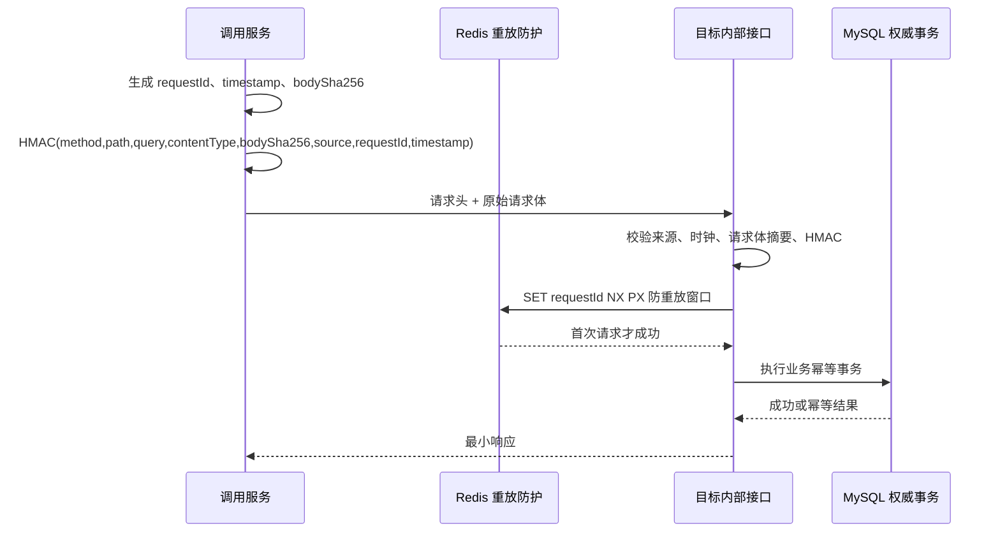
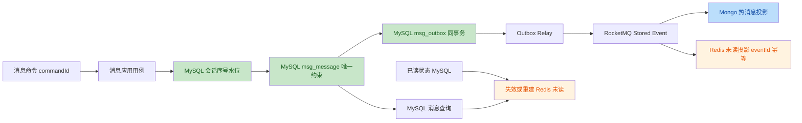

# IM 平台安全、数据权威性与工程门禁治理方案

## 1. 文档定位

本文是全工程专项治理方案，处理 2026-07-24 全仓规范审计确认的安全、Flyway、MySQL 权威性、Redis 投影、DDD 分层和构建门禁问题。

本文不修改下列规范，只定义整改目标、实施顺序、兼容策略、验收证据与回滚边界：

1. [业务微服务 DDD 工程规范](../standards/10_DDD_SERVICE_ENGINEERING_CONVENTIONS.md)。
2. [持久层技术栈标准](../standards/21_PERSISTENCE_STACK.md)。
3. [Java 日志规范](../standards/41_JAVA_LOGGING_CONVENTIONS.md)。
4. [RocketMQ 治理规范](../standards/12_ROCKETMQ_CONVENTIONS.md)。

未经评审确认，不执行本文涉及的密钥轮换、数据库迁移、内部协议、消息写入链路或发布门禁变更。

## 2. 背景、目标与非目标

### 2.1 已确认问题

| 编号 | 优先级 | 问题 | 风险 |
| --- | --- | --- | --- |
| S-01 | P0 | `.env` 已被 Git 跟踪且包含非空数据库、Redis、MongoDB、JWT、内部服务签名和推送凭据 | 凭据已进入仓库历史、克隆副本或构建环境，删除当前文件不能使已泄露凭据失效 |
| S-02 | P0 | user、message、conversation 服务存在可预测 JWT 回退密钥 | 非 Compose 或独立启动场景可被伪造 JWT 访问 |
| S-03 | P0 | 内部 HMAC 未签名请求体，且没有 nonce 或请求标识去重 | 内部写请求存在内容篡改与时间窗重放风险 |
| D-01 | P0 | user、admin 共用 MySQL schema 但未设置独立 Flyway history 表 | 默认 `flyway_schema_history` 互相污染，导致迁移被错误跳过或校验失败 |
| D-02 | P0 | 消息会话序号只由 Redis `INCR` 分配，MySQL 无唯一约束与持久化水位 | Redis 故障或清空后可产生重复或倒退序号，Redis 成为不可恢复事实来源 |
| D-03 | P0 | Redis 未读数无事件幂等、已读失效或重算机制 | Outbox 重试会重复增加计数，已读后计数长期漂移 |
| A-01 | P1 | user 域 Repository 使用 application 层 Result | 形成 `domain -> application` 反向依赖 |
| A-02 | P1 | conversation 内部 Controller 直接访问领域 Repository | API 层绕过 application 用例、事务和审计入口 |
| G-01 | P1 | Flyway 边界门禁未登记 `user_sticker_quota` | 统一验证必然失败，门禁与实际基线失真 |
| G-02 | P1 | POM 依赖收敛、POM 服务依赖图、安全默认值、Flyway 配置一致性尚未成为强制门禁 | 存量问题可被重新引入且无法在 CI 及时阻断 |
| D-04 | P2 | 部分基线迁移使用 `CREATE TABLE IF NOT EXISTS` | 已存在不兼容表时迁移被记录为成功，结构问题延迟到运行期暴露 |

### 2.2 总体目标

1. 所有凭据只通过受管密钥或本地未跟踪环境文件注入，仓库、日志、制品与镜像中不保留有效凭据。
2. JWT 与内部服务认证在所有部署路径中均为启动必填安全配置，禁止安全默认值。
3. 内部写请求必须具备来源认证、请求体完整性、短期防重放和业务幂等四层保护。
4. user、message、conversation、admin 在同一物理 schema 部署时，各自拥有独立 Flyway history 表和独立表所有权。
5. MySQL 是消息序号、消息事实、已读事实和 Outbox 的唯一权威库；Redis、MongoDB 与 RocketMQ 仅是可重建的缓存、投影或传输设施。
6. 所有 Redis 投影必须具备幂等、失效或从 MySQL 重建的路径，不得存储不可恢复业务事实。
7. 服务代码满足 `api -> application -> domain <- infra`，跨服务只通过 `*-api` 契约、受保护内部接口或事件协作。
8. 统一验证入口能够阻断凭据、弱密钥、Flyway 所有权、分层依赖、POM 依赖图和消息可靠性规则回退。

### 2.3 非目标

1. 不拆分新的微服务，不改变既有服务域所有权。
2. 不将 MongoDB、Redis、RocketMQ 或网关提升为权威业务库。
3. 不通过扩大 Spring 组件扫描或共享 Mapper、PO、Entity 恢复跨域调用。
4. 不回改已在任何环境执行的 Flyway 历史脚本；所有生产演进均通过新版本脚本完成。
5. 不以回滚 DDL 作为默认故障处理方式；数据库问题通过前向修复迁移解决。

## 3. 目标架构与约束

### 3.1 安全链路



内部认证只负责传输层来源、完整性与短期重放防护；业务幂等仍由每个写用例的稳定 `commandId`、`idempotencyKey` 或数据库唯一约束负责。二者不可互相替代。

### 3.2 消息权威与投影链路



关键约束如下：

1. `msg_message` 的 `(conversation_id, seq)` 必须由 MySQL 唯一约束兜底。
2. 消息序号分配必须从 MySQL 可恢复水位获得，Redis 不得是唯一发号器。
3. Mongo 热消息、Redis 未读数和 WebSocket 下行均可通过 MySQL + Outbox 重放恢复。
4. 已读状态以 MySQL `msg_read_status` 为准，Redis 未读数只能缓存聚合结果或作为失效后重算结果。

### 3.3 Flyway 所有权

| 服务 | 权威表范围 | Flyway history 表 | 迁移目录 |
| --- | --- | --- | --- |
| `im-user-service` | `user_*` | `user_schema_history` | `im-services/user/im-user-service/src/main/resources/db/migration` |
| `im-message-service` | `msg_*` | `msg_schema_history` | `im-services/message/im-message-service/src/main/resources/db/migration` |
| `im-conversation-service` | conversation 群组、成员、Outbox 表 | `conversation_schema_history` | `im-services/conversation/im-conversation-service/src/main/resources/db/migration` |
| `im-admin-service` | `adm_*` | `admin_schema_history` | `im-services/admin/im-admin-service/src/main/resources/db/migration` |

同一个物理数据库可以承载多个服务域，但每个服务必须只维护自身迁移目录和 history 表。任何服务均不得对他域表新增 PO、Mapper、Repository、SQL 或 Flyway 脚本。

## 4. 分批实施方案

### 4.1 批次 0：凭据止血与安全配置基线

#### 目标

立即消除已泄露凭据继续有效、弱默认密钥和错误 MySQL 容器默认值。

#### 实施步骤

1. 在密钥管理系统、MySQL、Redis、MongoDB、JPush 和部署平台中轮换 `.env` 已出现的全部凭据。
2. 评估仓库访问权限、fork、CI 日志、制品、镜像及开发机克隆副本，确认凭据传播范围。
3. 从 Git 索引移除 `.env`，将 `.env` 加入 `.gitignore`，新增 `.env.example`；示例文件只保留变量名、格式说明和无效占位值。
4. 所有服务删除 `JWT_SECRET`、数据库密码、Redis 密码、MongoDB 密码、内部签名密钥的默认值；缺失时必须在启动期失败，错误日志不得打印实际值。
5. 统一 JWT 校验器，至少验证非空、UTF-8 字节长度不小于 32、拒绝已知弱值与测试占位值。
6. Docker Compose 的 MySQL root 密码改为必填变量，开发端口改为 `127.0.0.1:3306:3306`；生产环境不发布数据库端口。
7. 引入凭据扫描：Git 工作树、暂存区、提交差异、Dockerfile、Compose、YAML、日志模板和文档均不得出现真实密钥。

#### 兼容与回滚

1. 密钥轮换采用双密钥验证窗口：先发布可同时验证旧/新 JWT 和内部 HMAC 的短期适配，再分批更新调用方，最后移除旧密钥。
2. JWT 双密钥窗口必须有明确过期时间，不能长期保留泄露密钥。
3. Git 历史重写前保留受限只读备份；开发分支迁移到清理后的新基线。
4. 不得通过恢复旧泄露密钥作为回滚手段。

#### 验收

1. `git ls-files .env` 无输出，`.env.example` 不含有效凭据。
2. 缺失任一生产安全变量时，服务启动失败并给出变量名，不输出变量值。
3. Docker Compose 在未设置 `DB_PASSWORD` 时拒绝启动 MySQL。
4. 安全扫描在工作树、合并请求和发布制品均无高危凭据。

### 4.2 批次 1：内部服务认证协议升级

#### 目标

使内部写请求具备传输完整性和防重放能力，并保持外部 HTTP 协议不受影响。

#### 协议定义

新增或统一以下内部请求头：

| Header | 含义 | 规则 |
| --- | --- | --- |
| `X-IM-Service-Source` | 调用服务标识 | 与允许调用方白名单匹配 |
| `X-IM-Service-Timestamp` | UTC Epoch 毫秒 | 允许时钟偏差默认不超过 60 秒 |
| `X-IM-Service-Request-Id` | UUID 或 128 位随机标识 | 每次请求唯一，禁止复用 |
| `X-IM-Service-Content-SHA256` | 原始请求体 SHA-256 十六进制摘要 | 空请求体使用固定空字节摘要 |
| `X-IM-Service-Signature` | HMAC-SHA256 签名 | 覆盖全部规范化字段 |

签名原文固定为：

```text
HTTP_METHOD\n
RAW_PATH\n
RAW_QUERY\n
CONTENT_TYPE\n
CONTENT_SHA256\n
SOURCE\n
REQUEST_ID\n
TIMESTAMP
```

实现要求：

1. 客户端拦截器在序列化后基于实际发送字节计算摘要，禁止对对象 `toString()` 或重新序列化结果签名。
2. 服务端在读取 Controller Body 前缓存原始请求体，以相同字节计算摘要；缓存包装器不得破坏 Spring 的请求体读取。
3. `requestId` 使用 Redis `SET key value NX PX` 原子写入；重复请求返回统一的内部认证重放错误，不进入业务 Controller。
4. Redis 不可用时，内部写接口默认拒绝，禁止绕过防重放直接放行；只读内部接口可在明确白名单下采用独立降级策略。
5. 每个内部写用例仍要求业务幂等键，积分等操作补齐 `idempotencyKey` 与数据库唯一约束。
6. 记录中文安全日志，至少包含 `source`、`requestId`、path、拒绝原因和关联 ID；不得记录签名、密钥或请求正文。

#### 兼容与发布

1. 新增协议版本 `v2`，服务端在迁移窗口同时接受 v1 与 v2，但 v1 仅允许只读接口或经明确审批的调用方。
2. 调用方全部切换到 v2 后，删除 v1 认证分支和旧测试。
3. 内部接口调用超时、签名错误、重放错误和权限拒绝必须有稳定错误码，调用方不得自动无限重试写请求。

#### 验收

1. 修改 body、Content-Type、path、query、source、timestamp 或 requestId 任一字段均被拒绝。
2. 相同请求在重放窗口内第二次被拒绝，且不产生第二条积分流水或状态操作记录。
3. 并发 100 次相同 requestId 时仅一次请求进入业务层。
4. 契约测试覆盖 v1 迁移兼容、v2 成功、篡改、过期、重放和 Redis 不可用。

### 4.3 批次 2：Flyway history 隔离与迁移治理

#### 目标

消除多服务共享默认 history 表导致的迁移冲突，并使迁移脚本、服务配置和所有权门禁一致。

#### 实施步骤

1. 为 user 和 admin 增加 `spring.flyway.table`，分别固定为 `user_schema_history` 与 `admin_schema_history`。
2. 对生产和预发布数据库导出原 `flyway_schema_history`、所有域表 DDL、版本记录和 checksum，形成迁移接管清单。
3. 对每个服务创建专属 history 表的接管脚本或受控运维步骤：只迁移该服务已确认执行的版本和 checksum，禁止简单清空历史后重新执行。
4. 新环境从空库完整迁移；`baseline-on-migrate` 仅用于经审计的存量库接管，不能作为常态规避迁移错误。
5. 修复 `validate-flyway-module-boundaries.ps1`：将 `user_sticker_quota`、`user_admin_status_operation` 纳入 user 域表清单，并按表类型处理审计字段规则。
6. 门禁扩展为验证迁移目录、Flyway Starter、`flyway-mysql`、`spring.flyway.enabled`、专属 history 表、表前缀、表所有权、版本单调性及已应用脚本不可修改。
7. 新建权威库基线不使用 `CREATE TABLE IF NOT EXISTS`；遗留表兼容必须由显式的结构检测、回填与增量迁移处理。

#### 风险与回滚

1. 历史默认 history 表可能混入多个服务的版本，必须先人工确认映射，不能由脚本猜测归属。
2. history 表切换失败时回退应用配置至旧 history 表，但不得删除已创建的专属 history 表和审计快照。
3. 已执行 Flyway 脚本一律不修改；错误通过新版本迁移修复。

#### 验收

1. 同一空 MySQL schema 启动四个服务后，均只创建自身表和自身 history 表。
2. `flyway info` 与 `flyway validate` 在四个服务中均成功，版本、描述和 checksum 一致。
3. 统一 Flyway 边界校验通过，并覆盖全部四个迁移所有者。

### 4.4 批次 3：消息序号和未读投影权威性重构

#### 目标

将消息排序和未读计算收敛到 MySQL 权威事实，Redis 只保留可重建加速能力。

#### 3.4.1 会话序号设计

新增 MySQL 权威会话序号表，例如 `msg_conversation_sequence`：

| 字段 | 语义 |
| --- | --- |
| `conversation_id` | 会话标识，主键 |
| `last_seq` | 已分配的最大序号 |
| `created_at` / `updated_at` | 审计时间 |

分配方式：

1. 在消息写入的本地事务中对会话序号行执行原子递增，获得新的 `last_seq`。
2. 对不存在的会话序号行使用插入初始化并处理并发唯一键冲突，然后重试读取和递增。
3. `msg_message` 新增唯一约束 `uk_msg_message_conversation_seq(conversation_id, seq)`。
4. Redis 可缓存最近序号，但任何缓存命中都不得跳过 MySQL 分配或唯一约束。
5. 迁移前先检测历史重复 `(conversation_id, seq)`，制定按 `created_at,id` 重新编号、客户端同步和投影重建计划；确认无重复后再创建唯一索引。

#### 3.4.2 未读投影设计

采用“事件幂等 + 已读失效 + MySQL 重算”的组合：

1. Redis 未读增量处理以 `eventId` 为幂等键，使用 Lua 或事务性原子脚本同时写入已处理标记和计数。
2. 已读成功后，不直接依据客户端 `msgIds` 盲目递减；删除用户未读缓存或写入短期失效标记。
3. 下次读取未读数时，从 MySQL 消息与已读状态按权威规则聚合并回填 Redis。
4. Outbox、MQ 或投影重放必须可以重复执行，不得使相同 `eventId` 再次增加未读数。
5. Redis 清空后，未读读取路径自动回源重建；重建任务可按用户分片异步预热，但不影响权威判断。

#### 3.4.3 Outbox Relay 约束

1. Outbox 仅负责将 MySQL 中已提交事件投递到 MQ，不直接决定权威消息状态。
2. Relay 必须记录尝试次数、最后错误、领取者、领取租约和最近尝试时间。
3. 多实例领取使用数据库原子状态更新或 `FOR UPDATE SKIP LOCKED`，并保证同一 `conversationId` 的事件不被并发乱序发布。
4. Mongo、Redis 投影消费端均使用 `eventId` 幂等，并提供按时间范围、用户或会话的重放能力。

#### 验收

1. Redis 清空、重启、故障切换后，同会话新消息序号仍严格大于 MySQL 现有最大序号。
2. 重复命令、重复 Relay、重复 MQ 投递和投影重放均不产生重复 `(conversation_id, seq)`、重复消息或重复未读数。
3. 已读后 Redis 删除或重建，重建结果与 MySQL 聚合结果一致。
4. 故障注入覆盖 DB 成功后 Relay 宕机、MQ 成功但状态未标记、MQ 失败、投影失败、消费者重启和 DLQ 重放。

### 4.5 批次 4：分层边界收口

#### 目标

消除已确认的领域反向依赖和 API 越层访问，并建立可持续阻断规则。

#### 用户域整改

1. 将 `ChangeUserStatusResult` 从 `UserStatusOperationRepository` 移除。
2. 在 `user.domain.account.model` 定义纯领域 `UserStatusOperation` 或值对象，包含幂等键、用户 ID、前后状态、状态版本、操作人、理由和创建时间。
3. Repository 以领域模型作为保存与查询出入参；application 层将领域模型转换为 `ChangeUserStatusResult`。
4. `AuthenticationUserProjection` 的 Redis 实现通过 user domain/application 定义的端口注入；application 层不得直接依赖 `StringRedisTemplate` 或平台具体 Redis Component。

#### 会话域整改

1. 在 `GroupAuthorizationQueryService` 中新增“群成员 ID 查询”应用用例与 Result。
2. `GroupMessageAuthorizationController` 只接收 API Query 并调用应用服务，禁止注入 `ConversationMemberRepository`。
3. 补充 API DTO 到 application Query/Result 的转换，Controller 不直接将领域对象映射到响应。

#### 全工程边界

1. `api` 仅依赖 application 与接口 DTO，禁止导入 Repository、Mapper、PO、Redis、MQ 和事务注解。
2. `application` 仅依赖 domain、Command/Query/Result 与抽象端口，禁止导入技术适配器实现。
3. `domain` 禁止依赖 application、api、infra、Spring、MyBatis、Redis、MongoDB、RocketMQ、HTTP 客户端和 JSON 实现。
4. `infra` 负责实现端口，不得反向承载 Controller、Request DTO 或业务状态迁移规则。
5. 跨服务 Java 依赖只允许 `*-api`；禁止任意 `*-service` 被其他服务作为依赖声明。

#### 验收

1. 架构测试覆盖 user、message、conversation、admin 四个服务。
2. 静态扫描不能在 domain 中发现 `.application.`、`.api.`、`.infra.`、Spring、MyBatis、Redis、RocketMQ、RestClient 或 Mapper import。
3. Controller 无 Repository/Mapper/PO/缓存/MQ 直接注入。

### 4.6 批次 5：统一门禁与发布治理

#### 目标

把已确认的质量要求从人工经验转化为构建阻断，做到“修一次，堵一类”。

#### 门禁清单

| 门禁 | 检查内容 | 阻断条件 |
| --- | --- | --- |
| 凭据门禁 | Git 跟踪文件、差异、Compose、YAML、脚本、文档中的秘密模式 | 发现有效格式密钥、跟踪 `.env`、弱默认密钥 |
| 启动安全门禁 | JWT、内部 HMAC、数据库和缓存配置 | 生产配置存在默认密码、默认 JWT 或缺少启动校验 |
| Flyway 门禁 | history 表唯一性、迁移所有权、表清单、版本和依赖 | 多服务默认 history 冲突、跨域表、目录/依赖不一致 |
| 架构门禁 | 包依赖、Controller 越层、domain 框架依赖、Service 直接依赖 | 违反 `api -> application -> domain <- infra` |
| 持久化门禁 | POM 依赖、PO/Mapper 归属、表所有权、MySQL 唯一约束 | 接入层持久化、跨域 Mapper、关键事实只在 Redis |
| 消息门禁 | Topic/Group 台账、`eventId` 幂等、顺序键、Outbox 状态 | 缺少幂等、顺序键或未登记 Topic/Group |
| 依赖收敛门禁 | Maven 上界依赖、依赖收敛、服务模块依赖图 | 新增冲突版本或跨服务 Service 依赖 |
| 文本与日志门禁 | UTF-8 无 BOM、弃用 API、中文异常上下文、日志规范 | 编码错误、静默 catch、手写 Logger、缺少关键异常上下文 |

#### 落地顺序

1. 先将新增规则接入报告模式，生成 `.outputs/quality/` 机器可读报告。
2. 为现存问题建立编号、责任模块、整改批次和到期条件，不接受无限期忽略。
3. 批次 0 至批次 4 清零对应问题后，将规则改为阻断模式并接入 `release_manager/verify.bat`。
4. 根 POM 接入 `requireUpperBoundDeps`；`dependencyConvergence` 先报告再阻断，完成 RocketMQ 传递依赖冲突收敛后强制执行。
5. `verify.bat` 必须输出每个脚本、Maven 阶段和 smoke test 的实际执行结果及退出码，禁止仅完成运行时预检查后静默成功。

#### 验收

1. `release_manager/verify.bat` 能实际串行执行静态门禁、`mvnw.cmd clean verify` 和 smoke test，并在任一步失败时返回非零退出码。
2. 本地与 CI 使用同一个 Wrapper、同一个入口、同一个输出目录和相同的规则版本。
3. 每次合并请求保留构建、测试、迁移和质量报告证据。

## 5. 实施顺序与依赖

```text
批次 0 凭据与安全配置
    -> 批次 1 内部 HMAC v2
    -> 批次 2 Flyway history 隔离
    -> 批次 3 消息权威性与投影重构
    -> 批次 4 分层边界收口
    -> 批次 5 强制门禁
```

1. 批次 0 必须最先完成，P0 凭据和弱默认密钥不能等待结构重构。
2. 批次 2 是批次 3 的前置条件，先稳定迁移 history 和表所有权，再为消息表追加序号表与唯一约束。
3. 批次 1 可与批次 2 并行，但内部协议升级必须先完成调用方契约测试再逐服务灰度。
4. 批次 3 与批次 4 可以交叠；禁止在消息权威链路未稳定前进行大范围调用协议变更。
5. 批次 5 从批次 0 开始报告模式执行，在对应存量问题清零后逐项切换为强制失败。

## 6. 发布、回滚与观测

### 6.1 发布前置检查

1. 完成数据库备份、Flyway history 导出、schema diff、Outbox 积压快照、消费者积压与 DLQ 快照。
2. 完成 JWT/HMAC 密钥轮换演练和内部调用契约回归。
3. 完成消息序号重复数据检查、唯一索引预演、Redis 未读投影重建演练。
4. 明确每批次的停止条件、责任人、发布窗口和回滚决策人。

### 6.2 回滚原则

1. 应用回滚只回滚可执行制品，不删除已发布 Outbox、MQ 事件或迁移 history。
2. 数据库采用前向兼容迁移；发生数据问题时新增修复迁移或暂停写入，禁止回改已执行脚本。
3. Redis、Mongo 和读投影可删除重建，禁止将投影数据反写至 MySQL 权威表。
4. HMAC v2 迁移窗口允许版本兼容，但过期后必须删除 v1，不得永久保留弱协议。

### 6.3 核心观测指标

| 范围 | 指标 |
| --- | --- |
| 安全 | JWT 启动校验失败数、HMAC 篡改拒绝数、重放拒绝数、内部认证失败来源分布 |
| Flyway | 各域 history 表版本、validate 失败数、迁移耗时、schema diff |
| 消息 | 会话序号冲突数、命令去重数、Outbox 积压时长、发布失败数、DLQ 深度 |
| 投影 | Redis 未读重建次数、投影重复抑制数、MySQL 与 Redis 对账差异、Mongo 重放耗时 |
| 工程质量 | 统一 verify 成功率、门禁失败类别、依赖收敛冲突数、架构违规数 |

## 7. 最终验收清单

1. 不存在受 Git 跟踪的 `.env` 或有效凭据，已轮换泄露凭据并留存审计记录。
2. 所有服务无 JWT、密码或内部签名密钥默认值，缺失安全配置时启动失败。
3. 内部写请求使用签名请求体摘要与 requestId 防重放，且业务层仍执行幂等。
4. 四个 Flyway 所有者在同一 schema 使用独立 history 表，空库和存量库升级均通过验证。
5. 消息序号由 MySQL 权威水位与唯一约束保障，Redis 清空后不会改变序号正确性。
6. Redis 未读数可从 MySQL 重建，重复事件和已读操作不会导致长期漂移。
7. user、message、conversation、admin 通过分层架构测试，Controller 无持久化越层访问，domain 无反向或框架依赖。
8. 统一验证入口真实执行并通过安全、迁移、架构、依赖、日志、编码、测试和 smoke test 门禁。
